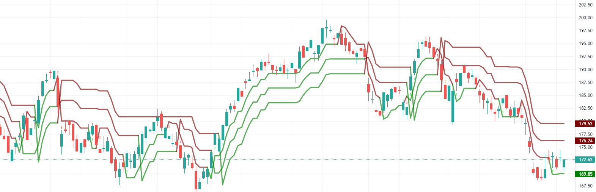
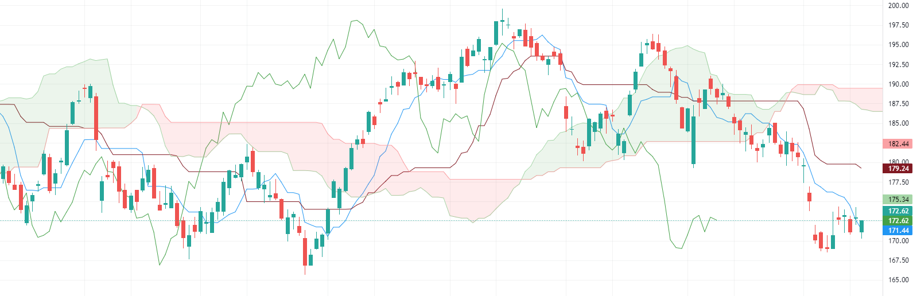
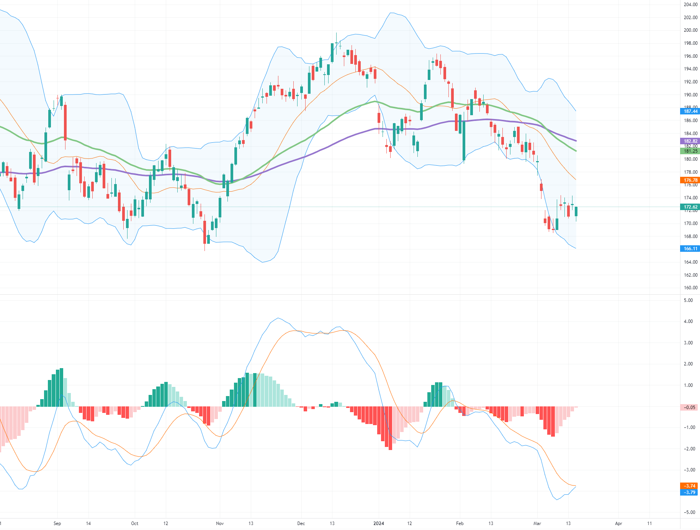
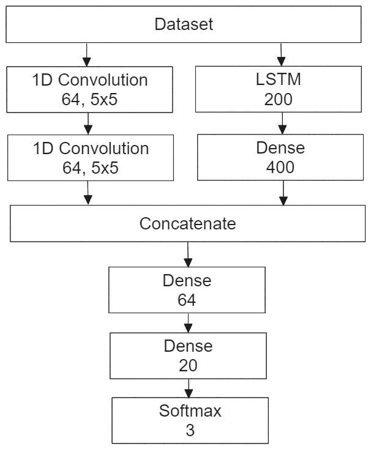
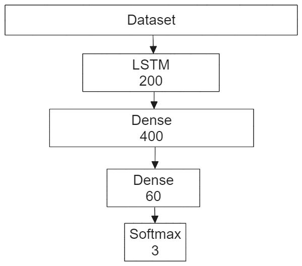
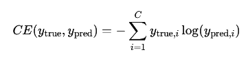
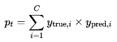
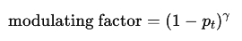
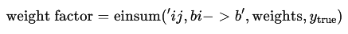
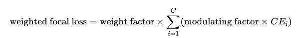

# Deep Predictions: Harnessing Neural Networks for Stock Price Movement Forecasting

## Project Overview

This project investigates the integration of Long Short-Term Memory (LSTM) and Feed Forward Neural Network (FFNN) architectures to forecast short-term market movements in the technology sector of the American financial markets. Our model aims to outperform traditional linear financial forecasting methods by capturing both temporal and non-temporal market dynamics using advanced neural network techniques and rigorous data preprocessing.

## Abstract

Our study applied a comprehensive dataset sourced from Yahoo Finance and Alpha Vantage, implementing early stopping to prevent overfitting, and confirmed model performance with validation loss trends and confusion matrix analysis. Challenges included the volatility and unpredictability of the technology sector. The study suggests cautious optimism for the LSTM and FFNN combination in financial forecasting, recommending further model refinements and continuous validation against real-world financial data.

## Authors

- Estevao Bittencourt
- Catherine Lennon
- Aidan Mitchell

Kennesaw State University \
CS 7357: Neural Networks and Deep Learning \
April 30, 2024

---

## Introduction

The project focuses on predicting short-term market movements in the technology sector, chosen for its rapid innovation and voluminous data. Traditional financial models often fail to capture the nonlinear intricacies and the multifaceted relationships within market data. Neural networks, particularly deep learning architectures like CNNs, FFNNs, and LSTMs, have shown promising potential to revolutionize financial analytics by modeling complex, nonlinear relationships and processing vast datasets to uncover hidden patterns and insights.

## Methodology

### Data Preprocessing and Feature Engineering

- **Dataset**: Apple Inc. (AAPL) stock data over ten years with daily trading information.
- **Technical Indicators**: Relative Strength Index (RSI), Exponential Moving Averages (EMA), Commodity Channel Index (CCI), and more were computed and appended to the dataset.
- **Examples of Trading Charts with Technical Indicators**:
  - Triple SuperTrend Technical Indicator
    
  - Ichimoku Cloud Technical Indicator
  
  - MACD Technical Indicator with Bollinger Bands
  

### Feature Standardization and Selection

- **Standardization**: Normalized the dataset using standardizing scalars.
- **Feature Reduction**: Applied Principal Component Analysis (PCA) to manage high dimensionality.
- **Class Distribution Adjustment**: Adjusted class distribution to prevent the model from favoring neutral predictions disproportionately.

### Model Architecture

- **Explored Architectures**:
  - Base Pure LSTM
  - Smaller Pure LSTM
  - Pure Convolution
  - Convolution then LSTM
  - Mixed Convolution and LSTM
      
  - RNN
  - Transformer
  - Simultaneous Convolution and LSTM

- **Final Architecture**: Several LSTM layers capturing temporal trends, feeding into a dense fully-connected feed-forward network.
  

### Loss Functions

- **Explored**: Categorical Cross Entropy, Weighted Categorical Cross Entropy, Focal Loss.
- **Final Choice**: Doubly Weighted Focal Loss to focus on cases where prediction confidence was critical.

### Training Stages

- Manual iteration through training parameters using various loss functions.
- Adjusted class samples balance and training epochs for stability and robustness.

## Experimental Setup

### Implementation

- **Computational Resources**:
  - CPU: AMD Ryzen 9 7900X
  - Memory: 32GB 6000MHz
  - GPU: NVIDIA RTX 3060Ti

### Data Sources

- **Alpha Vantage**: Comprehensive source of historical and real-time financial data.
- **YFinance**: Python library for acquiring historical market data from Yahoo Finance.
- **Data Points**: Historical stock prices, economic indicators, and financial statements.

### Evaluation Metrics

- **Accuracy**: Percentage of correctly predicted price movements.
- **Precision**: Ratio of true positives to the sum of true and false positives.
- **Recall (Sensitivity)**: Model's ability to identify all relevant instances correctly.

## Results

- **Training and Validation**: Demonstrated partial convergence with early stopping to prevent overfitting.
- **Confusion Matrix**: Analyzed for both training and validation datasets.

## Conclusion

While the model shows promise, challenges include the sensitivity to the volatility and unpredictability inherent in the technology sector. Further research and refinement are necessary, focusing on expanding the dataset, experimenting with different neural network configurations, and incorporating more granular data related to specific market drivers.

## References

1. [Maciel & Ballini](https://citeseerx.ist.psu.edu/document?repid=rep1&type=pdf&doi=bcbb8ca9d6a6ce6017710ebf6143da76b6ed)
2. [Ge et al.](https://dl.acm.org/doi/pdf/10.1145/3483596)
3. [Lu et al.](https://www.researchgate.net/profile/Uzochukwu-Onwuachu/publication/295261436_A_Neural_Network_Approach_to_Financial_Forecasting/links/620c7a90634ff774f4d1562c/A-Neural-Network-Approach-to-Financial-Forecasting.pdf)
4. [Chen, Leung, & Daouk](https://citeseerx.ist.psu.edu/document?repid=rep1&type=pdf&doi=10d1f52113df1d52926f7271e2c35076e571bd08)
5. [Dunis & Jalilov](https://dl.acm.org/doi/pdf/10.1145/3483596)
